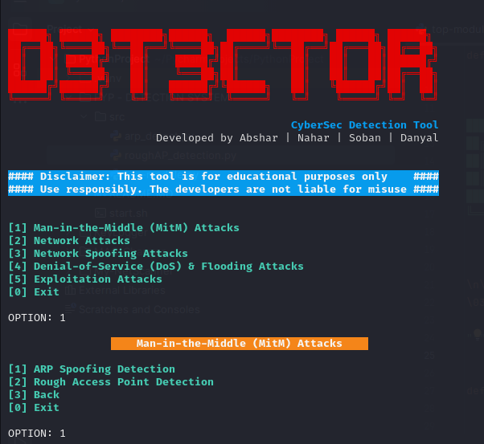

# D3T3CTOR Framework

## Overview
D3T3CTOR is a cybersecurity framework designed to detect and analyze various network attacks. This tool is intended for educational and testing purposes only, providing a platform for cybersecurity enthusiasts and professionals to study network vulnerabilities and attack vectors.

**Disclaimer:** This tool is under maintenance and currently supports all Linux-based systems. The developers are not liable for any misuse of this tool. Use it responsibly and only in environments where you have explicit permission to conduct testing.

---
<h1 align="center">D3T3CTOR Framework</h1>
<p align="center">
    
</p>


## Features  
✔️ Detects ARP spoofing attempts  
✔️ Identifies DNS spoofing attacks  
✔️ Monitors and detects deauthentication attacks  
✔️ Lightweight and efficient  
✔️ Compatible with all **Linux** distributions  

---

## Installation

To install and run D3T3CTOR, follow these steps:

1. Gain sudo Access:
   ```bash
   sudo su
   ```

2. Clone the repository:
   ```bash
   git clone https://github.com/Abshar-Shihab/D3T3CTOR.git
   ```

3. Navigate to the D3T3CTOR directory:
   ```bash
   cd D3T3CTOR
   ```

4. Make the startup script executable:
   ```bash
   chmod +x start.sh
   ```

5. Run the tool:
   ```bash
   ./start.sh
   ```

---

## Usage
Once the tool is running, it will automatically start monitoring your network for the specified attacks. Follow the on-screen instructions to configure and interact with the tool.

---

## Tested On
D3T3CTOR has been tested and verified on the following Linux distributions:
- Ubuntu 20.04 LTS
- Kali Linux 2023.2
- Debian 11

---

## Disclaimer
D3T3CTOR is developed for educational and testing purposes only. The developers are not responsible for any misuse of this tool. Ensure you have proper authorization before using this tool on any network. Use it at your own risk.

---

## Contributing
We welcome contributions to improve D3T3CTOR. If you'd like to contribute, please fork the repository and submit a pull request with your changes.

---

**Happy Testing!** 🛡️
